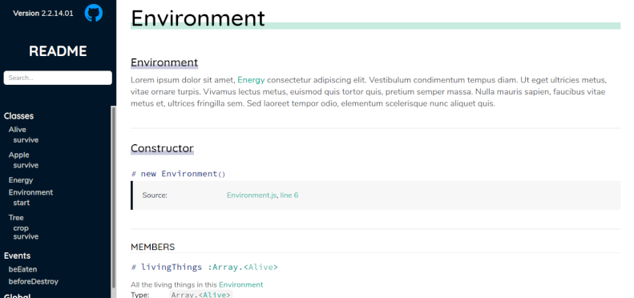
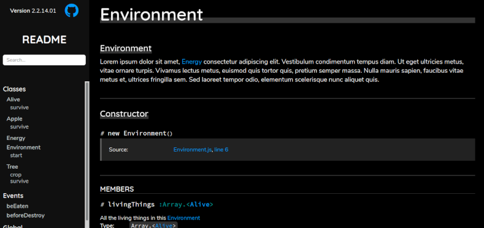

# clean-jsdoc

A stylish fork of [clean-jsdoc-theme][]




## Quick start

Install `jsdoc`:

```bash
npm i --save-dev jsdoc
```

Clone this repo to your desired template directory:

```bash
git clone 'https://github.com/rdipardo/clean-jsdoc-theme.git' path/to/template/directory
```

Now run:

```bash
node_modules/.bin/jsdoc path/to/src/**/*.js -t path/to/clean-jsdoc
```

### Advanced Usage

Configure `jsdoc` to use this template in your `.jsdoc.json` file:

```json
"opts": {
  "template": "./node_modules/clean-jsdoc-theme"
}
```

For example:

```json
{
    "plugins": ["plugins/markdown"],
    "source": {
        "include": ["src", "README.md"],
        "includePattern": ".+\\.js(doc|x)?$",
        "excludePattern": "(node_modules/|docs)"
    },
    "sourceType": "module",
    "tags": {
        "allowUnknownTags": true,
        "dictionaries": ["jsdoc", "closure"]
    },
    "opts": {
        "template": "./node_modules/clean-jsdoc-theme",
        // see below
        "theme_opts": {},
        "encoding": "utf8",
        "readme": "./README.md",
        "destination": "docs/",
        "recurse": true
    }
}
```

Add a script to your `package.json`:

```json
"script": {
  // ...
  "gendocs": "node_modules/.bin/jsdoc -c .jsdoc.json --verbose"
}
```

Build your docmentation with: `npm run gendocs`

## Options

_All options must be defined under `opts.theme_opts` in your `.jsdoc.json`_

### Basic

| name        | purpose                                                 | type                       | default                            | options                                       |
|:-----------:|:-------------------------------------------------------:|:--------------------------:|:----------------------------------:|:---------------------------------------------:|
| `theme`     | the overall style theme                                 | string                     | `"light"`                          | `["light", "dark"]`                           |
| `search`    | enable fuzzy search using [Fuse.js][]                   | bool                       | `true`                             |                                               |
| `langNames` | display language names in code blocks                   | bool                       | `true`                             |                                               |
| `title`     | the name of the home link to display on the nav bar     | HTML string                | `"README"`                         | any valid HTML markup, or just a plain string |
| `footer`    | a footer to display in the page layout                  | HTML string                | JSDoc version, date and theme info | any valid HTML markup                         |
| `meta`      | a list of elements to add to the `head` of each page    | ["HTML string", ...]       | [  ]                              | any valid HTML `meta` or `link` element        |
| `add_style_path` | a list of user-defined stylesheets                 | ["path/to/style.css", ...] | [  ]                              | file paths (relative to `index.html`)          |
| `add_script_path` | a list of user-defined scripts                    | ["path/to/script.js", ...] | [  ]                              | _as above_                                     |

### Advanced

### `"project": {}`

Basic details about the status of your project, e.g.

```json
  "project": {
      "title": "clean-jsdoc",
      "version": "2.2.14.01",
      "repo": "https://github.com/rdipardo/clean-jsdoc-theme"
  }
```

##### Required properties

| name      | type   |
|:---------:|:------:|
| `version` | string |
| `repo`    | URL    |

##### Optional properties

| name    | purpose                                                              | type   |
|:-------:|:--------------------------------------------------------------------:|:------:|
| `title` | the title of the project; it will appear in every page's `title` tag | string |


#### `"menu": [{}, ...]`

A list of hyperlinks to add to the navigation bar, e.g.

```json
  "menu": [
    {
      "title": "Website",
      "link": "https://heredocs.com",
      "target": "_blank",
      "class": "some-class",
      "id": "some-id"
    }
  ]
```

##### Required properties

| name    | type   |
|:-------:|:------:|
| `title` | string |
| `link`  | URL    |

##### Optional properties

| name     | type                  |
|:--------:|:---------------------:|
| `target` | HTML target attribute |
| `class`  | CSS class selector    |
| `id`     | CSS id selector       |


#### `"create_style": ""`

Inline CSS for the `head` of the page layout, e.g.:

```json
    "create_style": "nav { background: yellow }"
```

#### `"add_scripts": ""`

Inline JavaScript to add to the page layout, e.g.:

```json
    "add_scripts": "function foo() { console.log('foo') }",
```

## Testing

To generate a demo website in the `demo/output` folder, run:

```bash
npm i && npm i jsdoc --no-save
npm test
```

If `xdg-open` is on your system, you can build and preview the site in one step with: `npm run browse`

## License

Copyright (c) 2019 [Ankit Kumar](https://github.com/ankitskvmdam/)
Copyright (c) 2020 [Robert Di Pardo](https://github.com/rdipardo/)

Distributed under the terms of the MIT license.

[clean-jsdoc-theme]: https://github.com/ankitskvmdam/clean-jsdoc-theme
[Fuse.js]: https://fusejs.io/
